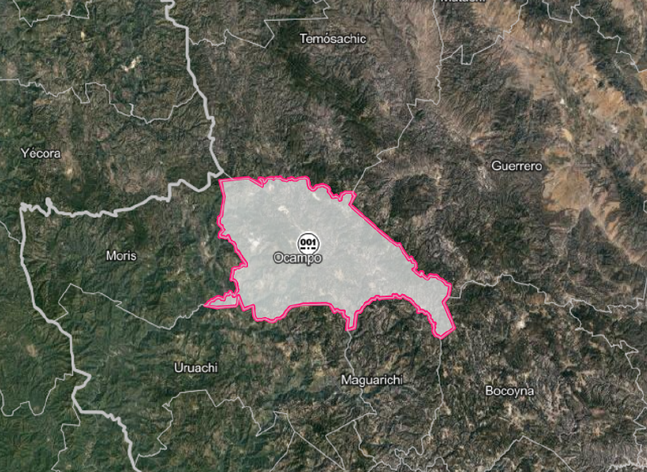

# Fuentes de información {.unnumbered}

Primeramente, las fuentes de información que se utilizaron para la realización del índice de calidad del entorno se enumeran a continuación:  


## CPV2020 {-}


El Censo de Población y Vivienda 2020 (CPV2020) del INEGI (Instituto Nacional de Estadística y Geografía) el objetivo fue recopilar información detallada y actualizada sobre la población y las viviendas de México para ser utilizada en la toma de decisiones y la planificación de políticas públicas y privadas en el país. Esto incluye datos sobre la cantidad y características de las personas que viven en el país, como su edad, sexo, educación, ocupación, entre otros aspectos, así como información sobre la estructura y características de las viviendas en las que habitan. El cúal este tpo de informción es importante para la planificación y la toma de decisiones en áreas como la política pública, la inversión en infraestructura, la distribución de recursos y servicios, la investigación demográfica y social, y muchas otras. Además, también es utilizado por empresas y organizaciones para el análisis de mercado y la toma de decisiones estratégicas.  


## Equipamiento {-}

<a href="images/IE_Subsectores.png" data-lightbox="image-1" data-title="Subsectores">
```{r, echo = FALSE, fig.width=12, fig.height=12, out.width='100%'}
require(knitr)
knitr::include_graphics(paste0(here::here(), "/images/IE_Subsectores.png"))
```
</a>


### DENUE {-}

[El Directorio Estadístico Nacional de Unidades Económicas (DENUE)](https://www.inegi.org.mx/rnm/index.php/catalog/668) es la infraestructura mínima del Subsistema Nacional de Información Económica (SNIE), cuyo propósito es proveer a los usuarios tanto especializados como no especializados de los datos de identificación, ubicación y contacto de las unidades económicas activas en el territorio nacional para el desarrollo y evaluación, tanto de políticas públicas como de programas de fomento económico en los tres niveles de gobierno; así como apoyo en el proceso de toma de decisiones para direccionar la inversión y optimizar recursos tanto en el ámbito público como en el privado.

[El Directorio Estadístico Nacional de Unidades Económicas (DENUE)](https://www.inegi.org.mx/rnm/index.php/catalog/668) del INEGI cuyo objetivo es proporcionar una base de datos actualizada y completa de las unidades económicas en México. Esto incluye empresas, establecimientos, instituciones gubernamentales, organizaciones sin fines de lucro, entre otras entidades que realizan actividades económicas en el país. Este tipo de insumo sirve como base para la planificación económica, la investigación y la toma de decisiones en áreas como la inversión, el análisis de mercado, el diseño de políticas públicas, la identificación de oportunidades comerciales, entre otras. Además, también es utilizado por el sector empresarial para el análisis de la competencia, la segmentación de mercado, la identificación de clientes potenciales, entre otros fines.


**[Sistema de Clasificación Industrial de América del Norte, 2018 (SCIAN)]** 

El objetivo del SCIAN México es proporcionar un marco único, consistente y actualizado para la recopilación, análisis y presentación de estadísticas de tipo económico, que refleje la estructura de la economía mexicana. El SCIAN México es la base para la generación, presentación y difusión de todas las estadísticas económicas del INEGI. Su adopción por parte de las Unidades del Estado, permitirá homologar la información económica que se produce en el país, y con ello contribuir a la de la región de América del Norte.   

**UNIDAD DE ANÁLISIS**

Las unidades económicas a las que está referida la información del DENUE son dos: El establecimiento y la empresa.

- **El establecimiento:** unidad económica que, en una sola ubicación física, asentada en un lugar de manera permanente y delimitada por construcciones e instalaciones fijas, combina acciones y recursos bajo el control de una sola entidad propietaria o controladora para realizar alguna actividad económica sea con fines de lucro o no.
    
    Incluye a las viviendas en las que se realizan actividades económicas y excluye a las viviendas en las que se llevan a cabo actividades económicas con fines de autoconsumo, así como los servicios que se realizan en otros sitios.
    
- **La empresa:** organización, propiedad de una sola entidad jurídica, que realiza una o más actividades económicas, con autonomía en la toma de decisiones de mercadeo, financiamiento e inversión, al contar con la autoridad y responsabilidad de distribuir recursos de acuerdo con un plan o estrategia de producción de bienes y servicios, pudiendo estar ubicada u operar en varios domicilios.
- **Se excluye** a las unidades económicas que llevan a cabo actividades de manera ambulante o aquellas en las que los locales en los que se efectúa la actividad económica son desmontables y se remueven diariamente.

Se consideran 13 subsistemas económicos de los cuales se clasificaron 52 elementos económicos que pertenecen a los subistemas. 

```{r, eval = FALSE, comment="R/01_SCIAN2018.R"}
load(paste0(here::here(), "/Bases/Claves_subsistema_SCIAN2018.RData"))
```

Se cargan todas las bases del DENUE 2021 que se van a usar, el cúal después se van a seleccionar los subramos económicos. 


Descarga masiva
En esta sección podrás descargar los archivos del DENUE, el Banco de Indicadores, el Inventario Nacional de Viviendas, Microdatos y la Sala de prensa por área geográfica, proyectos, años de la información, temas y formatos para poder utilizar la información en forma local en tu equipo.
Title: Directorio Estadístico Nacional de Unidades Económicas (DENUE) 05_2021

Se muestra el algoritmo para integrar el DENUE 

```{r, eval = FALSE, class.source = 'fold-hide', comment="02_DENUE_Integrado.Rmd"}
tablas <- c("43", "46111", "46112-46311","46321-46531", "46591-46911", "48-49", "51", "52", "56", "61", "62", "71",  "72_1", "72_2", "81_1", "81_2")

# Enlaces de las bases de datos (Descargas masivas | INEGI | DENUE)
#https://www.inegi.org.mx/app/descarga/default.html
url <- read.table(file = "Bases/DENUE/Enlaces_DENUE_0521.txt", sep = ",")

for(i in 1:16){
  if(!file.exists(paste0(here::here(), "/Bases/DENUE/denue_00_", tablas[i], "_0521_csv.zip"))){
  download.file(url[i,], paste0(here::here(), "/Bases/DENUE/denue_00_", tablas[i], "_0521_csv.zip"), mode = "wb")
  }
}

# Se agrupan 16 bases de datos en formato CVS en un solo data.frame 
for(i in tablas){
  assign(paste0("df_",i), read.csv(paste0(here::here(), "/DENUE/CSV/CSV/conjunto_de_datos/denue_inegi_",i,"_.csv"), fileEncoding = "latin1"))
}

# Se agrupan todas las tablas en una sola
lista <- ls(pattern =  "df_")
denue_2021 <- do.call(rbind.data.frame, mget(lista))

denue_2021 <- denue_2021 %>%
               select(codigo_act, nombre_act, cve_ent, entidad, cve_mun, municipio, cve_loc, localidad, ageb, manzana) %>% 
                 mutate(cve_ent = stringr::str_pad(.$cve_ent, 2, "left", pad = "0"), 
                        cve_mun = stringr::str_pad(.$cve_mun, 3, "left", pad = "0"),
                        cve_loc = stringr::str_pad(.$cve_loc, 4, "left", pad = "0"),
                        ageb = stringr::str_pad(.$ageb, 4, "left", pad = "0"),
                        manzana = stringr::str_pad(.$manzana, 3, "left", pad = "0")) %>%
                   mutate(CVE_MUN = paste0(.$cve_ent, .$cve_mun),
                          CVE_LOC = paste0(.$cve_ent, .$cve_mun, .$cve_loc),
                          CVE_AGEB = paste0(.$cve_ent, .$cve_mun, .$cve_loc, .$ageb), 
                          CVE_MZA =  paste0(.$cve_ent, .$cve_mun, .$cve_loc, .$ageb, .$manzana)) %>%
# Se anexa la base de Claves
                    left_join(., SCIAN, 
                               by = c("codigo_act" = "CODIGO")) %>%
                      mutate(CVE_ELE = as.character(.$CVE_ELE))

# Se guarda la base de datos donde se integran 16 bases de datos
save(denue2021, file = paste0(here::here(), "/Bases/DENUE/denue2021.RData"))
```

Se integran las claves geoestadísticas para la elaboración de los indicadores simples

```{r, eval = FALSE}
# Estructura integrada del DENUE
load(paste0(here::here(), "/Bases/denue_integrado.RData"))
codigo <- unique(SCIAN$CODIGO)
```


#### Municipio {-}

```{r, eval = FALSE}
denue_mun <- denue_2021 %>%
              filter(.$codigo_act %in% codigo) %>%
               select(ELEMENTO, CVE_MUN) %>%
                melt(., id = c("CVE_MUN"))  %>%
                 mutate(value = as.character(.$value)) %>%
                  acast(., CVE_MUN ~ value, drop = FALSE) %>% 
                   as.data.frame() %>% 
                    tibble::rownames_to_column(., "CVE_MUN") %>%
                     mutate(CVE_ENT = substr(.$CVE_MUN, 1, 2)) %>%
                      relocate(CVE_ENT, .before = "CVE_MUN") %>%
                       group_by(CVE_ENT) %>%
                        mutate_at(vars(c(-CVE_ENT, -CVE_MUN)), funs(./sum(.)*100))%>%
                         replace(., is.na(.), 0)

save(denue_mun, file = paste0(here::here(), "/Bases/Municipio/Indicadores_DENUE.RData"))
```

#### Localidad {-}

```{r, eval = FALSE}
denue_loc <- denue_2021 %>%
              filter(.$codigo_act %in% codigo) %>%
               select(ELEMENTO, CVE_LOC) %>%
                melt(., id = c("CVE_LOC"))  %>%
                 mutate(value = as.character(.$value)) %>%
                  acast(., CVE_LOC ~ value, drop = FALSE) %>% 
                   as.data.frame() %>% 
                    tibble::rownames_to_column(., "CVE_LOC") %>%
                     mutate(CVE_MUN = substr(.$CVE_LOC, 1, 5)) %>%
                      relocate(CVE_MUN, .before = "CVE_LOC") %>%
                       group_by(CVE_MUN) %>%
                        mutate_at(vars(c(-CVE_MUN, -CVE_LOC)), funs(./sum(.)*100))%>%
                         replace(., is.na(.), 0)

save(denue_loc, file = paste0(here::here(), "/Bases/Localidad/Indicadores_DENUE.RData"))
```

#### AGEB {-}

```{r, eval = FALSE}
denue_ageb <- denue_2021 %>%
               filter(.$codigo_act %in% codigo) %>%
                select(ELEMENTO, CVE_AGEB) %>%
                 melt(., id = c("CVE_AGEB"))  %>%
                  mutate(value = as.character(.$value)) %>%
                   acast(., CVE_AGEB ~ value, drop = FALSE) %>% 
                    as.data.frame() %>% 
                     tibble::rownames_to_column(., "CVE_AGEB")  %>%
                      mutate(CVE_LOC = substr(.$CVE_AGEB, 1, 9)) %>%
                       relocate(CVE_LOC, .before = "CVE_AGEB") %>%
                        group_by(CVE_LOC) %>%
                         mutate_at(vars(c(-CVE_LOC, -CVE_AGEB)), funs(./sum(.)*100))%>%
                          replace(., is.na(.), 0)

save(denue_ageb, file = paste0(here::here(), "/Bases/AGEB/Indicadores_DENUE.RData"))
```

### SEP {-}


```{r, eval = FALSE, comment="03_SEP_Estructura.Rmd"}
load(paste0(here::here(), "/Bases/SEP_Estructura.RData"))
```

#### Municipio {-}

**Se utiliza la base de datos a nivel municipio, ya que esta presenta todo el universo de escuelas en el país.**  

```{r, eval = FALSE}
sep_mun <- SEP %>%
            select(CVE_MUN, `Nivel educativo`) %>%
             reshape2::melt(., id = c("CVE_MUN")) %>%
              acast(., CVE_MUN ~ value, drop = FALSE) %>%
               as.data.frame() %>% 
                tibble::rownames_to_column(., "CVE_MUN") %>%
                 mutate(CVE_ENT = substr(.$CVE_MUN, 1, 2)) %>%
                  relocate(CVE_ENT, .before = "CVE_MUN") %>%
                   group_by(CVE_ENT) %>%
                    mutate_at(vars(c(-CVE_MUN, -CVE_ENT)), funs(./sum(.)*100))%>%
                     replace(., is.na(.), 0)
save(sep_mun, file = paste0(here::here(), "/Bases/Municipio/Indicadores_Escuelas_SEP.RData"))
```

#### Localidad {-}

```{r, eval = FALSE}
sep_loc <- SEP %>%
                select(CVE_LOC, `Nivel educativo`) %>%
                 reshape2::melt(., id = c("CVE_LOC")) %>%
                   acast(., CVE_LOC ~ value, drop = FALSE) %>%
                    as.data.frame() %>% 
                     tibble::rownames_to_column(., "CVE_LOC") %>%
                      mutate(CVE_MUN = substr(.$CVE_LOC, 1, 5)) %>%
                        relocate(CVE_MUN, .before = "CVE_LOC") %>%
                         group_by(CVE_MUN) %>%
                          mutate_at(vars(c(-CVE_LOC, -CVE_MUN)), funs(./sum(.)*100))%>%
                           replace(., is.na(.), 0)

save(sep_loc, file = paste0(here::here(), "/Bases/Localidad/Indicadores_Escuelas_SEP.RData"))
```

#### AGEB {-}

```{r, eval = FALSE, comment="03_SEP_Estructura.Rmd"}
load("Bases/SEP_Estructura_AGEB.RData")
```

```{r, eval = FALSE}
sep_ageb <- sep_ageb %>%
                select(CVE_AGEB, `Nivel educativo`) %>%
                 reshape2::melt(., id = c("CVE_AGEB")) %>%
                   acast(., CVE_AGEB ~ value, drop = TRUE) %>% # drop = FALSE
                    as.data.frame() %>% 
                     tibble::rownames_to_column(., "CVE_AGEB") %>%
                      mutate(CVE_LOC = substr(.$CVE_AGEB, 1, 9)) %>%
                        relocate(CVE_LOC, .before = "CVE_AGEB") %>%
                         group_by(CVE_LOC) %>%
                          mutate_at(vars(c(-CVE_AGEB, -CVE_LOC)), funs(./sum(.)*100))%>%
                           replace(., is.na(.), 0)

save(sep_ageb, file = paste0(here::here(), "/Bases/AGEB/Indicadores_Escuelas_SEP.RData"))
```

### CLUES {-}

```{r, eval = FALSE, comment="04_CLUES_Estructura.Rmd"}
load("Bases/CLUES_Estructura.RData")
```


#### Municipio {-}

```{r, eval = FALSE}
clues_mun <- CLUES %>%
                select(`Nivel de atención`, CVE_MUN) %>%
                 melt(., id = c("CVE_MUN"))  %>%
                  mutate(value = as.character(.$value)) %>%
                   acast(., CVE_MUN ~ value, drop = FALSE) %>% 
                    as.data.frame() %>% 
                     tibble::rownames_to_column(., "CVE_MUN") %>%
                      mutate(CVE_ENT = substr(.$CVE_MUN, 1, 2)) %>%
                       relocate(CVE_ENT, .before = "CVE_MUN") %>%
                        group_by(CVE_ENT) %>%
                         mutate_at(vars(c(-CVE_ENT, -CVE_MUN)),funs(./sum(.)*100))%>%
                          replace(., is.na(.), 0)

save(clues_mun, file = paste0(here::here(), "/Bases/Municipio/Indicadores_CLUES.RData"))
```

#### Localidad {-}

```{r, eval = FALSE}
clues_loc <- CLUES %>%
                select(`Nivel de atención`, CVE_LOC) %>%
                 melt(., id = c("CVE_LOC"))  %>%
                  mutate(value = as.character(.$value)) %>%
                   acast(., CVE_LOC ~ value, drop = FALSE) %>% 
                    as.data.frame() %>% 
                     tibble::rownames_to_column(., "CVE_LOC") %>%
                      mutate(CVE_MUN = substr(.$CVE_LOC, 1, 5)) %>%
                       relocate(CVE_MUN, .before = "CVE_LOC") %>%
                        group_by(CVE_MUN) %>%
                         mutate_at(vars(c(-CVE_MUN, -CVE_LOC)),funs(./sum(.)*100))%>%
                          replace(., is.na(.), 0)

save(clues_loc, file = paste0(here::here(), "/Bases/Localidad/Indicadores_CLUES.RData"))
```

#### AGEB {-}

```{r, eval = FALSE, comment="04_CLUES_Estructura.Rmd"}
load(paste0(here::here(), "/Bases/CLUES_Estructura_AGEB.RData"))
```

```{r, eval = FALSE}
clues_ageb <- CLUES_AGEB %>%
                select(`Nivel de atención`, CVE_AGEB) %>%
                 melt(., id = c("CVE_AGEB"))  %>%
                  mutate(value = as.character(.$value)) %>%
                   acast(., CVE_AGEB ~ value, drop = FALSE) %>% 
                    as.data.frame() %>% 
                     tibble::rownames_to_column(., "CVE_AGEB") %>%
                      mutate(CVE_LOC = substr(.$CVE_AGEB, 1, 9)) %>%
                       relocate(CVE_LOC, .before = "CVE_AGEB") %>%
                        group_by(CVE_LOC) %>%
                         mutate_at(vars(c(-CVE_LOC, -CVE_AGEB)),funs(./sum(.)*100))%>%
                          replace(., is.na(.), 0)

save(clues_ageb, file = paste0(here::here(), "/Bases/AGEB/Indicadores_CLUES.RData"))
```


## IAL {-}

### Municipio {-}

```{r, eval = FALSE}
load(paste0(here::here(), "/Bases/Municipio/IA_municipio.Rdata"))
```


### Localidad {-}

```{r, eval = FALSE}
load(paste0(here::here(), "/Bases/Localidad/IA_localidad.Rdata"))
```

## Entorno Urbano {-}

Dada la importancia de los proyectos sobre el entorno urbano, destacada por informes como el que presentó ONU-Hábitat sobre el Estado de las ciudades en América Latina y el Caribe 2012 o el de CEPAL-CELADE en el cual se afirma que debe adoptarse como acuerdo de trabajo que los temas de entorno, equipamiento y medio ambiente se incorporen a los censos para definir la calidad y adecuación de la vivienda, en particular la urbana.


Algortinmo de integración del Entorno Urbano

```{r, eval = FALSE}
tablas <- c(paste0("0", seq(1, 9, 1)), seq(10, 32, 1))

for(i in tablas){
 assign(paste0("TI_", i), read_sav(paste0(here::here(), "/TI_MANZANA/TI_MANZANA_EU_",i,".SAV")))
}

# Se agrupan todas las tablas en una sola
lista <- ls(pattern = "TI_")
MANZANA_EU_2020 <- do.call(rbind.data.frame, mget(lista))

MANZANA_EU_2020 <- MANZANA_EU_2020 %>% 
                    select("ENT", "CVE_MUN","CVE_LOC","CVE_AGEB","PERSONAS", "VIVPARHAB", "TOTLADO", "TOTVIAL", "TOTRASGO", contains("_N")) %>%
                     mutate(PAVIM_ADOQ_N = .$PAVIM_N + .$ADOQ_N) %>%
                      select("ENT", "CVE_MUN","CVE_LOC","CVE_AGEB","PERSONAS", "VIVPARHAB", "TOTLADO", "TOTVIAL", "TOTRASGO", PAVIM_ADOQ_N, S_RPEAT_N, S_RAUTO_N,
                             C_PASOPEAT_N, C_DRENAJEP_N, C_TRANSCOL_N, C_CICLOVIA_N, C_CICLOCARRIL_N, C_LETRERO_N, C_RAMPA_N, C_SEMAFOROPEAT_N, C_SEMAFOROAUDI_N,
                             C_PARADATRANS_N, C_ESTACIONBICI_N, C_ALUM_N, C_PSEMI_N, S_PAMBU_N, C_BANQ_N, C_GUAR_N)

# Se guarda la base de datos donde se integran 16 bases de datos
save(MANZANA_EU_2020, file = paste0(here::here(), "/Bases/MANZANA_EU_2020.RData"))
```

No enfocamos en los indicadores númericos. 

```{r, eval = FALSE}
load(paste0(here::here(), "/Bases/MANZANA_EU_2020.RData"))
```

###  `Caso particular` {-}

**Caso particular**
**Municpio de Ocampo / Localidad Melchor Ocampo**  
Debido a la falta de información de este municipio, se toma como referencia a los municipios vecinos. 

- `08009` Bocoyna  
- `08031` Guerrero  
- `08041` Maguarichi  
- `08047` Boris  
- `08063` Temósachic
- `08066` Uruachi

<center>
{#id .class width=450 height=300px}
</center>

Fuente: [Espacio y datos de México (INEGI)](https://www.inegi.org.mx/app/mapa/espacioydatos/default.aspx)

```{r, eval = FALSE}
EU_mun <- MANZANA_EU_2020 %>%
           select("ENT", "CVE_MUN", "PERSONAS", "VIVPARHAB", "TOTLADO", "TOTVIAL", "TOTRASGO", contains("_N")) %>%
             filter(CVE_MUN %in% c("08009", "08031", "08041", "08047", "08063", "08066")) %>%
              select(-CVE_MUN) %>%
                group_by(ENT) %>% 
                  summarise(across(where(is.numeric), sum)) %>%
                   ungroup() %>%
                    mutate_at(vars(c(-ENT, -PERSONAS,-VIVPARHAB,-TOTLADO)),funs((./TOTLADO)*100))

save(EU_mun, file = paste0(here::here(), "/Bases/Municipio/EU_mun.RData"))
```


### Nivel Localidad {-}

```{r, eval = FALSE}
EU_loc <- MANZANA_EU_2020 %>%
             select("CVE_LOC", "PERSONAS", "VIVPARHAB", "TOTLADO", "TOTVIAL", "TOTRASGO", contains("_N")) %>%
              group_by(CVE_LOC) %>% 
               summarise(across(where(is.numeric), sum)) %>%
                ungroup() %>%
                 mutate_at(vars(c(-CVE_LOC, -PERSONAS,-VIVPARHAB,-TOTLADO)), funs((./TOTLADO)*100))

save(EU_loc, file = paste0(here::here(), "/Bases/Localidad/EU_loc.RData"))
```


### Nivel AGEB {-}

```{r, eval = FALSE}
EU_ageb <- MANZANA_EU_2020 %>%
            select("CVE_AGEB", "PERSONAS", "VIVPARHAB", "TOTLADO", "TOTVIAL", "TOTRASGO", contains("_N")) %>%
              group_by(CVE_AGEB) %>% 
               summarise(across(where(is.numeric), sum)) %>%
                ungroup() %>%
                 mutate_at(vars(c(-CVE_AGEB, -PERSONAS,-VIVPARHAB,-TOTLADO)), funs((./TOTLADO)*100))

save(EU_ageb, file = paste0(here::here(), "/Bases/AGEB/EU_ageb.RData"))
```


```{r,echo = FALSE}
rm(list = ls())
```
